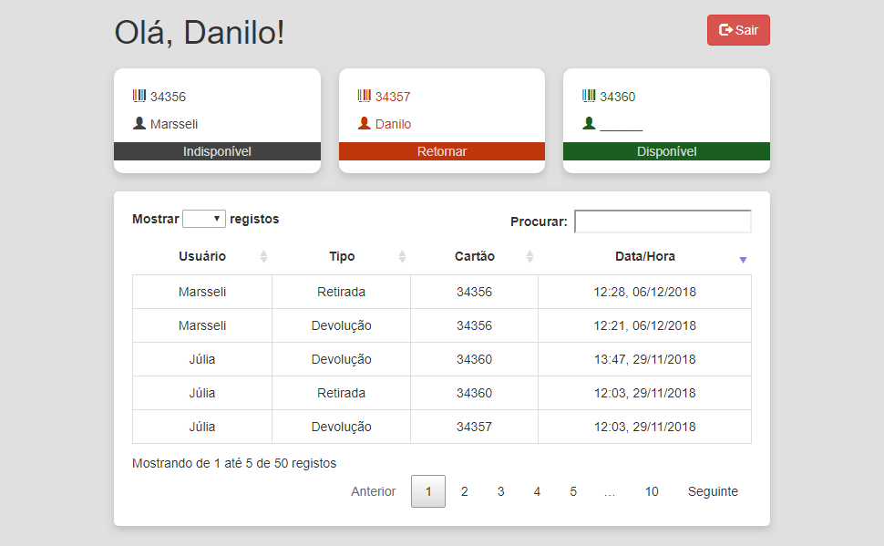

<br />
<p align="center">
  <a href="https://github.com/daniloimparato/cocaru">
    
  </a>
    <br />
    <h3 align="center">
        <strong>COCARU</strong>
    </h3>
  <p align="center">
    Controle de Cartões RU
    <br />
    <h2 align="center">
        <a href="https://daniloimparato.github.io/cocaru"><strong>Demo</strong></a>
    </h2>
    <br />
  </p>
</p>
## Intro

COCARU controla a entrada e saída de cartões do RU pertencentes ao centro acadêmico. Documentação em breve.

<p align="center"></p>

### Pré-requisitos

Projeto Firebase
Firebase tools

### Instalação

Em breve

### Deployment

```
firebase deploy
```

## Feito com

* [Firebase] (https://firebase.google.com/docs/) - BaaS
* [jQuery] (https://jquery.com/) - Biblioteca javascript
* [Bootstrap 3] (http://getbootstrap.com/) - CSS framework
* [DataTables] (https://datatables.net/) - Table viz

## Authors

* **Danilo Imparato**

## Licença

Em breve
